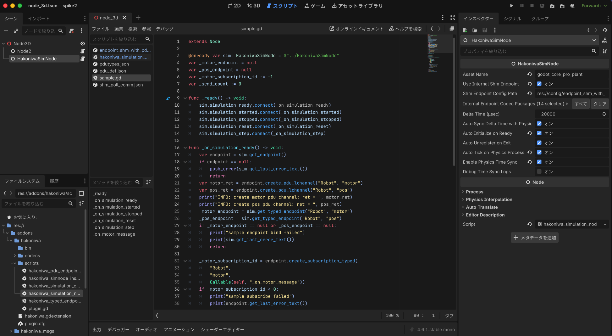

# Godot + Python Minimal PDU Example

このディレクトリには、`HakoniwaSimNode` を使って **Godot と Python が `geometry_msgs/Twist` を双方向にやり取りする最小素材**を置きます。

含まれるもの:

- `sample.gd`
  - Godot 側の最小 script
- `python_controller_ep.py`
  - Python 側の最小 controller
  - `hakopy` は asset register 用
  - PDU 通信は `hakoniwa-pdu-endpoint` の `Endpoint` を使う
- `config/`
  - PDU 定義と endpoint 設定
  - Godot 側は SHM poll、Python 側は SHM callback を使う

## 何が分かるか

- `HakoniwaSimNode` を 1 つ置けば internal SHM endpoint を持てる
- `simulation_ready` 後に internal endpoint を安全に触れる
- `notify_on_recv=true` を使う PDU は、start 前に channel 作成が必要
- Godot 側は typed endpoint で `motor` を受信し、`pos` を送信できる
- Python 側は `hakopy + Endpoint` で `motor` を送信し、`pos` の受信 callback を扱える

## 使う PDU

- `motor`
  - `geometry_msgs/Twist`
- `pos`
  - `geometry_msgs/Twist`

## 前提

この example を動かすには、Godot addon と `geometry_msgs` codec が使える状態である必要があります。  
build 手順や codec の準備方法は repo ルートの [README.md](../../README.md) を参照してください。

Python 側は `hakopy` と `hakoniwa-pdu-endpoint` がインストール済みである前提です。

- `hakopy`
  - 箱庭 core との接続に使う
- `hakoniwa-pdu-endpoint`
  - PDU 通信に使う

## 使い方

1. 既存 Godot project に `HakoniwaSimNode` を置く
2. scene の root node に [sample.gd](sample.gd) 相当の script を attach する
3. `config/` を project 側へコピーする
4. `HakoniwaSimNode` に次を設定する
   - `Use Internal Shm Endpoint = On`
   - `Shm Endpoint Config Path = res://config/endpoint_shm_with_pdu.json`
   - `Internal Endpoint Codec Packages = ["geometry_msgs"]`
   - `Asset Name` を Python 側 config と整合する名前に設定する
   
   コードで設定する場合の例:

   ```gdscript
   _sim.internal_endpoint_codec_packages = PackedStringArray([
   	"geometry_msgs"
   ])
   ```
5. `sample.gd` のように、`simulation_ready` 後に internal endpoint で channel を作る
   - 下記のコード例を参照
6. Python 側では [python_controller_ep.py](python_controller_ep.py) を使う
7. Python 側の起動引数には [endpoint_shm_callback_with_pdu.json](config/endpoint_shm_callback_with_pdu.json) を渡す

設定例:



`notify_on_recv=true` の PDU を internal SHM endpoint で使う場合、Godot 単体では channel 作成者がいないため、start 前に明示的に作る必要があります。

`sample.gd` では `simulation_ready` 後にこうしています。

```gdscript
var endpoint = sim.get_endpoint()
endpoint.create_pdu_lchannel("Robot", "motor")
endpoint.create_pdu_lchannel("Robot", "pos")
```

## よくある詰まりどころ

- `get_endpoint()` が `null` になる
  - `Use Internal Shm Endpoint` が無効、または `Shm Endpoint Config Path` が未設定です
- typed send / recv が失敗する
  - `Internal Endpoint Codec Packages` に `geometry_msgs` が入っていません
- Python と通信できない
  - `Asset Name` が SHM 側 config と一致していません
- `notify_on_recv=true` で start に失敗する
  - start 前に `create_pdu_lchannel()` を呼んでいません

## 起動手順

```bash
# terminal 1
bash tools/run_core_pro_conductor.sh

# terminal 2
python python_controller_ep.py config/endpoint_shm_callback_with_pdu.json

# terminal 3
<GODOT_BIN> --path /path/to/your_godot_project
```

Python 側には `config/endpoint_shm_callback_with_pdu.json` を渡します。  
Godot 側には `config/endpoint_shm_with_pdu.json` を使います。  
terminal 3 の起動は、Godot project 側で `HakoniwaSimNode` の Inspector 設定が済んでいる前提です。  
この example 自体は repo 内の完成済み Godot project ではなく、既存 project に持ち込む素材として扱います。

## 成功時ログ

Godot:

```text
simulation started
motor={...}
pos={...}
step simtime=... world=...
```

Python:

```text
HAKO_PYTHON_EP_ENDPOINT_READY
HAKO_PYTHON_EP_POST_START_OK
HAKO_PYTHON_EP_WRITE_MOTOR:...
Robot 1 Twist(linear=Vector3(...), angular=Vector3(...))
```
