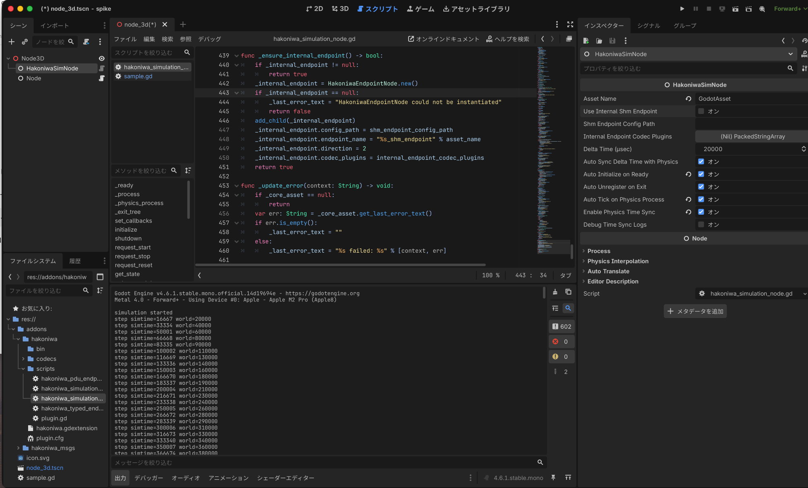

# SimNode Minimal

このディレクトリには、`HakoniwaSimNode` を既存 Godot project に持ち込むための最小素材を置きます。

含まれるもの:

- `sample.gd`
  - `simulation_started`
  - `simulation_step`
  を受けて最小ログを出すだけの script

## `sample.gd`

- [sample.gd](sample.gd)

この script は次の signal を受けます。

- `simulation_started`
- `simulation_step`

補足:

- internal endpoint を使う場合、`get_endpoint()` や subscription 作成は `_ready()` 直後ではなく `simulation_ready` signal を起点にする

期待する最小ログ:

```text
simulation started
step simtime=16667 world=20000
step simtime=33334 world=40000
...
```

## 最小設定

`HakoniwaSimNode` の known-good 設定:

- `Use Internal Shm Endpoint`: オフ
- `Delta Time (usec)`: `20000`
- `Auto Initialize on Ready`: オン
- `Auto Tick on Physics Process`: オン
- `Enable Physics Time Sync`: オン

設定例:



## 最小手順

### 1. conductor を起動する

```bash
cd /path/to/hakoniwa-godot
bash tools/run_core_pro_conductor.sh
```

### 2. Godot project を起動する

`HakoniwaSimNode` を置いた既存 Godot project を起動します。

```bash
<GODOT_BIN> --path /path/to/your_godot_project
```

### 3. `hako-cmd start` を実行する

```bash
hako-cmd start
```

## 確認ポイント

- `simulation started` のログが出る
- `step simtime=... world=...` のログが継続して流れる

## 使い方

1. 既存 Godot project に `HakoniwaSimNode` を置く
2. scene の root node に `sample.gd` 相当の script を attach する
3. node path を自分の scene 構成に合わせる

初期セットアップと最短手順は [../../docs/quick_start.md](../../docs/quick_start.md) を参照してください。  
addon の導入方法は [../../docs/installation.md](../../docs/installation.md) を参照してください。
